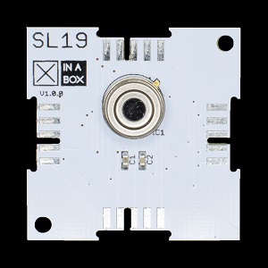

# ☒CHIP SL19

Infra Red Thermometer.

This module can be purchased on [Xinabox CC](https://xinabox.cc/products/SL19/).

## About the SL19
This ☒CHIP forms part of the sensor modules 

Module is based off the MLX90614 Remote 4-Bit I2C and SMBus I/O Expander.

- MLX90614 - The MLX90614 is an Infra Red thermometer for non-contact temperature measurements [datasheet](https://www.melexis.com/-/media/files/documents/datasheets/mlx90614-datasheet-melexis.pdf).

## Requirements
  - [☒Core Library](https://github.com/xinabox/xCore)
  - [Arduino IDE](https://www.arduino.cc/en/main/software)
  - ☒CHIP [Core](https://xinabox.cc/collections/core)
  
## Installation Guide
To install the libraries please followed the guide provided on the [Arduino Website](https://www.arduino.cc/en/Guide/Libraries) under "**Importing a .zip Library**".
